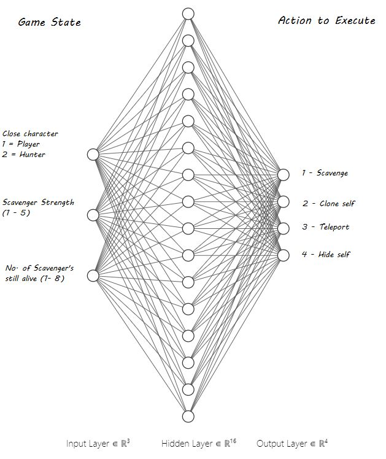

# A.I 20/21 - Main Assignment - Charlie Conneely G00348887

### Game Description 
There are three game characters:
* **Scavengers** - Includes all ghosts accept the red with green eyes. The goal of the scavenger is to eat as many hedges as possible to gain strength. When the scavenger eats a hedge, it gains the ability to check for a hunter or player within a short proximity. If one of these are close by, the scavenger will perform one of the following actions:
  * *Scavenge* - Continuing eating hedges.
  * *Clone Self* - Clone a version of itself to confuse the enemy.
  * *Teleport* - Teleport a short distance.
  * *Hide Self* - Spawn hedges around itself to hide within (only defends against players).

* **Hunters** - Red ghosts with green eyes. These will randomly move around until a Scavenger or Player comes into it's proximity. It will then follow a path to the coordinate at which the prey was detected. If a Hunter touches a Scavenger, it will kill the Scavenger immediately. It can kill a player by moving directly onto the player's coordinate or by touching (striking) the player 20+ times. 

* **Player** - The goal of the player is to kill all Scavengers to save hedges, whilst avoiding Hunters.

When the player or all of the Scavengers are dead the over all score is printed out.  

***

### AI Implementations
* **Neural Network**
  * An encog Basic Neural Network was implemented to trigger the appropriate Scavenger action based off a number of input variables:
  * 
  * The network consists of a single Simoid activation layer of 16 nodes. These parameters were chosen as they delivered consistent & fast training at a low cost.

* **Fuzzy Logic**
  * The jFuzzyLogic library was used to determine the over all score based off of the following variables:
    * No. of hedges eaten (0-200).
    * No. of Strikes taken from Hunters (0-20).
    * No. of Scavengers eaten by Hunters (0-8).
    * The sets to represent the universe of discourse for all: Low, Medium, High.
  * COG was chosen as the defuzzifier because:
    * It's most accurate.
    * Computational overhead is not a concern in this case.

* **A\* Path Finding** 
  * The A\* Path finding algorithm is used to provide the Hunter with a path to it's prey. 
  * A\* was chosen as it is highly configurable to the game situation/parameters.
  * Manhattan Distance was chosen as the heuristic as it computes distance given no diagonal movement. 
  * The map of nodes was created to represent locations on the map.
  * A maximum search distance of 500 nodes was defined to prevent the thread from crashing.

